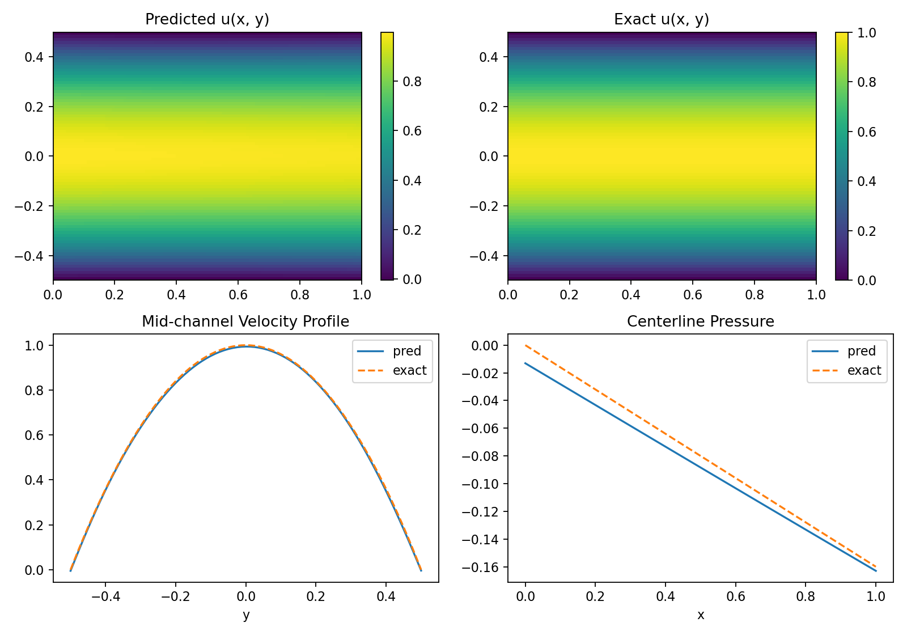
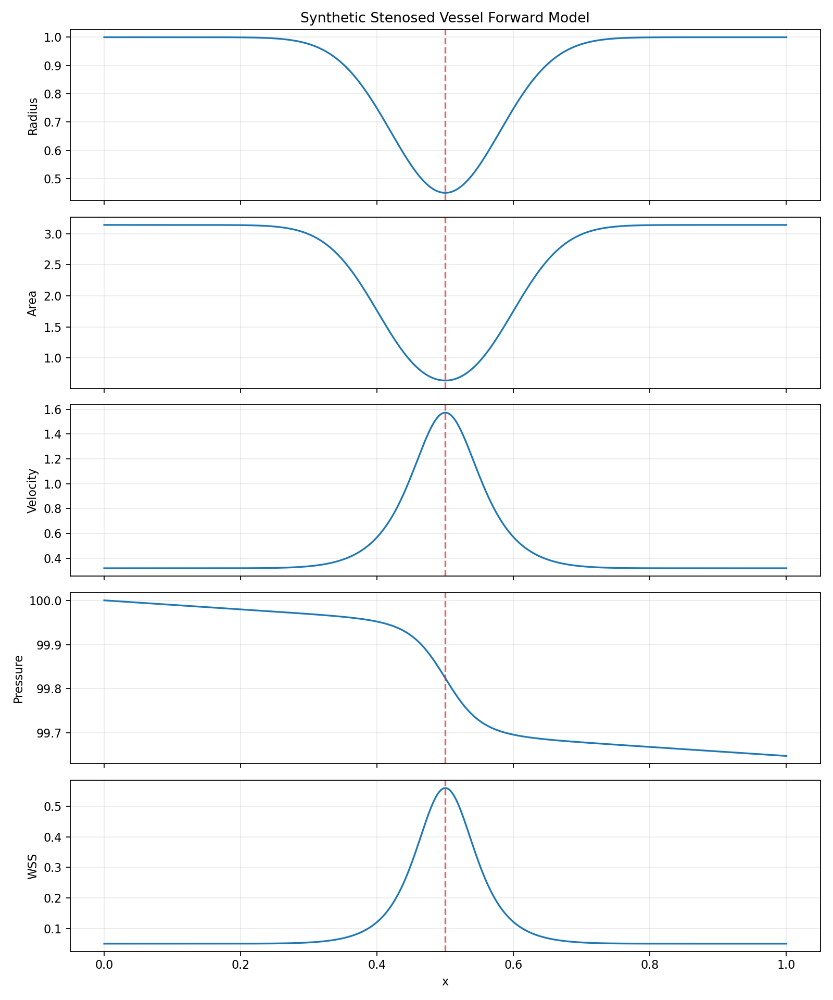
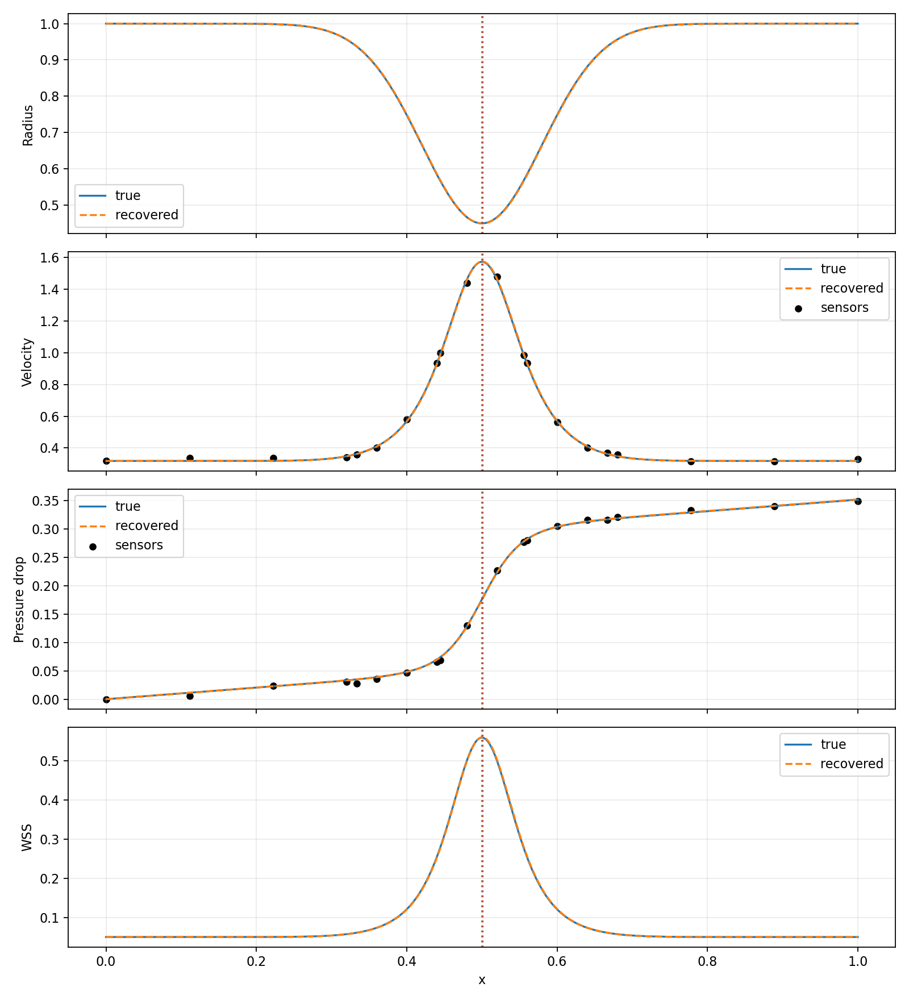
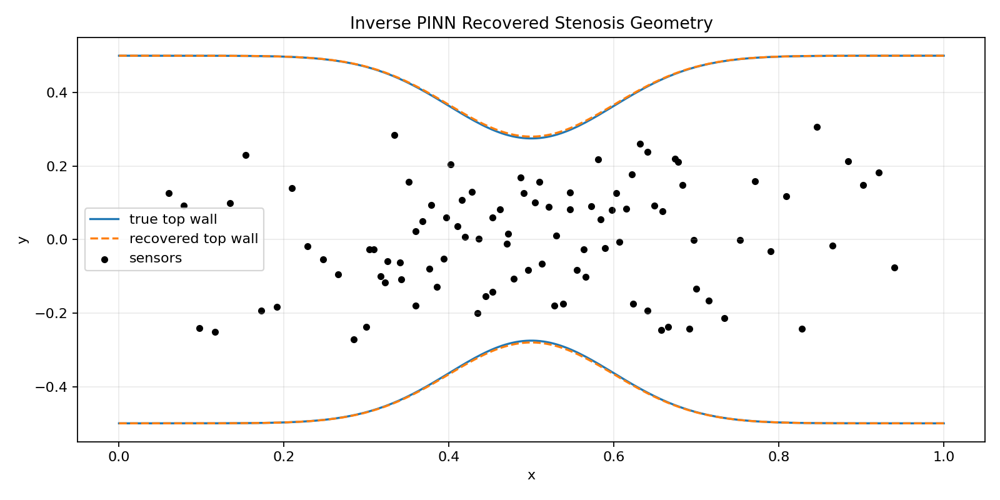

# PINN Fluid Stenosis

This repository contains a complete 2D project for PINN-based cardiovascular
hemodynamics and stenosis detection. The completed scope is:

- a baseline Physics-Informed Neural Network (PINN) solver for healthy 2D
  Poiseuille flow,
- synthetic stenosed single-vessel and Y-bifurcation tree forward models,
- reduced-order inverse recovery baselines for fast comparison,
- a richer 2D stenosed-channel PINN with curved no-slip walls,
- a main inverse 2D PINN that jointly recovers stenosis severity/location and
  the velocity-pressure field.

The project intentionally stops at the 2D stenosis stage. No 3D solver or 3D
surrogate component is included in this submission.

## Installation

```bash
python3 -m venv .venv
source .venv/bin/activate
pip install -r requirements.txt
```

The scripts also work without installing the package because each runner adds
`src/` to `PYTHONPATH` automatically.

## Mathematical Formulation

The full formulation is provided in:

- `MATHEMATICAL_FORMULATION.tex`
- `MATHEMATICAL_FORMULATION.pdf`

## Visual Results Summary

The figures below show the main evidence that the completed 2D stenosis
pipeline is behaving correctly.

### 1. Baseline Healthy-Channel PINN



The baseline PINN solves steady 2D Poiseuille flow in a straight channel. It
learns the parabolic axial velocity profile, near-zero transverse velocity, and
near-linear pressure drop expected from the analytical solution.

Key verification results:

- relative L2 axial-velocity error: `0.00883`
- mean absolute continuity residual: `0.00529`
- mean absolute x-momentum residual: `0.00988`
- mean absolute y-momentum residual: `0.00508`

### 2. Synthetic Single-Vessel Stenosis



The synthetic forward model uses a Gaussian radius reduction to create a known
stenosis. This produces the expected hemodynamic response: the radius narrows,
velocity accelerates through the throat, pressure drops faster, and wall shear
stress rises near the lesion.

Key verification results:

- stenosis severity: `0.55`
- minimum radius: `0.4500`
- velocity gain vs healthy vessel: `4.94x`
- pressure-drop gain vs healthy vessel: `3.46x`
- lesion pressure-drop fraction of total drop: `0.797`

### 3. Y-Bifurcation Vessel Tree


The tree model extends the forward problem to one inlet branch splitting into
two outlet branches. Outlet flow is assigned by Murray-style radius weighting,
and pressure is propagated from the inlet through the bifurcation into each
outlet.

Key verification results for a left-outlet stenosis:

- inlet flow: `1.0`
- outlet flow sum: `1.0`
- flow conservation error: `0.0`
- stenosed branch max velocity: `1.69`
- stenosed branch pressure drop: `0.615`
- pressure decreases monotonically on all branches: `true`

### 4. Reduced-Order Inverse Recovery Baseline



The reduced-order inverse baseline recovers the hidden stenosis severity and
center from sparse synthetic velocity and pressure-drop observations. This is a
fast comparison baseline, while the final stenosis-detection method remains the
inverse 2D PINN.

Key verification results:

- true severity: `0.55`
- recovered severity: `0.5503`
- severity absolute error: `0.00029`
- true center: `0.50`
- recovered center: `0.5005`
- total pressure-drop relative error: `0.00156`

### 5. Improved 2D Stenosed-Channel PINN


The richer 2D PINN solves steady Navier-Stokes flow over a curved stenosed
channel. This stage uses a stronger network, lesion-focused and near-wall
sampling, stricter residual weights, and a weak synthetic-reference term to
stabilize pressure and velocity learning without replacing the physics loss.

Key verification results:

- mean absolute continuity residual: `0.0593`
- mean absolute x-momentum residual: `0.0989`
- mean absolute y-momentum residual: `0.0464`
- pressure drop: `0.2087`
- throat velocity gain vs inlet: `1.015x`

### 6. Main Result: Inverse 2D PINN Stenosis Detection



The inverse 2D PINN jointly learns the velocity-pressure field and the hidden
stenosis parameters. This keeps stenosis detection inside the PINN framework by
combining Navier-Stokes residuals, boundary conditions, sparse flow-pressure
measurements, and sparse wall-geometry observations.

Key verification results:

- true severity: `0.45`
- recovered severity: `0.4400`
- severity absolute error: `0.00996`
- true center: `0.50`
- recovered center: `0.499997`
- center absolute error: `0.0000025`
- mean absolute continuity residual: `0.0380`

## Baseline problem

We solve steady incompressible Navier-Stokes flow in a 2D channel:

- domain: `x in [0, L]`, `y in [-H/2, H/2]`
- no-slip walls at `y = +/- H/2`
- parabolic inlet velocity profile
- zero transverse velocity at inlet and outlet
- fixed outlet pressure

The analytical Poiseuille solution is used only for evaluation metrics and the
known inlet/outlet boundary data:

- `u(y) = u_max * (1 - (y / (H/2))^2)`
- `v(x, y) = 0`
- `p(x) = p0 + (dp/dx) * x`

## Run the baseline

```bash
python3 scripts/run_poiseuille_baseline.py --epochs 3000
```

Outputs are written to `outputs/poiseuille_baseline/`:

- `metrics.json`: quantitative verification metrics
- `training_history.png`: loss curves
- `poiseuille_solution.png`: predicted vs exact velocity/pressure

## Run the synthetic stenosed vessel

```bash
python3 scripts/run_synthetic_stenosis.py --severity 0.55 --flow-rate 1.0
```

Outputs are written to `outputs/synthetic_stenosis/`:

- `metrics.json`: stenosis geometry and hemodynamic summary
- `stenosis_forward_model.png`: radius, area, velocity, pressure, and wall shear
- `comparison_to_healthy.png`: stenosed vessel vs healthy vessel

## Run inverse stenosis recovery

This is the reduced-order single-vessel inverse baseline. It is useful for
fast debugging and comparison against the full inverse PINN.

```bash
python3 scripts/run_inverse_stenosis.py --true-severity 0.55 --true-center 0.5
```

Outputs are written to `outputs/inverse_stenosis/`:

- `metrics.json`: true vs recovered stenosis parameters
- `history.json`: optimization history
- `inverse_training_history.png`: loss and parameter convergence
- `inverse_reconstruction.png`: true and recovered hemodynamic fields

## Run branching tree forward model

```bash
python3 scripts/run_tree_stenosis.py --stenosed-branch left_outlet --severity 0.55
```

Outputs are written to `outputs/tree_stenosis/`:

- `metrics.json`: branch flow, pressure-drop, and stenosis summary
- `tree_forward_model.png`: radius, velocity, pressure-drop, and wall shear by branch

## Run inverse tree stenosis recovery

This is the reduced-order branching-tree inverse baseline. It recovers the
stenosed outlet branch and severity without solving the full 2D PINN.

```bash
python3 scripts/run_inverse_tree_stenosis.py --true-branch left_outlet --true-severity 0.55
```

Outputs are written to `outputs/inverse_tree_stenosis/`:

- `metrics.json`: true vs recovered branch and severity
- `history.json`: optimization history
- `inverse_tree_training_history.png`: loss and outlet severity convergence
- `inverse_tree_reconstruction.png`: true and recovered branch fields

## Run 2D stenosed channel PINN

```bash
python3 scripts/run_stenosed_channel_pinn.py --severity 0.45
```

Outputs are written to `outputs/stenosed_channel_pinn/`:

- `metrics.json`: PDE residuals, pressure drop, and throat velocity summary
- `stenosed_channel_training_history.png`: loss curves
- `stenosed_channel_fields.png`: velocity magnitude and pressure over the 2D stenosed domain

This stage now uses a stronger 5-layer, 96-width PINN, lesion-focused and
near-wall collocation sampling, stricter continuity/momentum residual weights,
and a weak synthetic-reference term to stabilize pressure and velocity learning
without replacing the Navier-Stokes residual.

## Run inverse 2D stenosed channel PINN

This is the primary PINN-based stenosis detection step. The solver jointly
learns the velocity-pressure field and the hidden stenosis severity/center.

```bash
python3 scripts/run_inverse_stenosed_channel_pinn.py --true-severity 0.45 --true-center 0.5
```

Outputs are written to `outputs/inverse_stenosed_channel_pinn/`:

- `metrics.json`: true vs recovered stenosis severity and center
- `history.json`: optimization history
- `inverse_pinn_training_history.png`: PINN loss and parameter convergence
- `inverse_pinn_geometry.png`: true vs recovered stenosed wall geometry

## Expected behavior

The baseline is behaving correctly if it learns:

- a near-parabolic axial velocity profile
- near-zero transverse velocity
- a near-linear pressure drop along the channel
- low PDE residuals on a dense evaluation grid

## Verification Commands

Run the main static and numerical checks with:

```bash
python3 -m compileall src scripts
python3 scripts/run_poiseuille_baseline.py --epochs 1500 --output-dir outputs/check_poiseuille_baseline
python3 scripts/run_synthetic_stenosis.py --severity 0.55 --output-dir outputs/check_synthetic_stenosis
python3 scripts/run_inverse_stenosis.py --true-severity 0.55 --true-center 0.5 --epochs 1200 --output-dir outputs/check_inverse_stenosis
python3 scripts/run_tree_stenosis.py --stenosed-branch left_outlet --severity 0.55 --output-dir outputs/check_tree_left
python3 scripts/run_tree_stenosis.py --stenosed-branch right_outlet --severity 0.55 --output-dir outputs/check_tree_right
python3 scripts/run_inverse_tree_stenosis.py --true-branch left_outlet --true-severity 0.55 --output-dir outputs/check_inverse_tree_left
python3 scripts/run_inverse_tree_stenosis.py --true-branch right_outlet --true-severity 0.65 --output-dir outputs/check_inverse_tree_right
python3 scripts/run_stenosed_channel_pinn.py --severity 0.45 --output-dir outputs/check_stenosed_channel_pinn
python3 scripts/run_inverse_stenosed_channel_pinn.py --true-severity 0.45 --true-center 0.5 --output-dir outputs/check_inverse_stenosed_channel_pinn
```

The heavier 2D PINN checks run on CPU but may take a few minutes.
