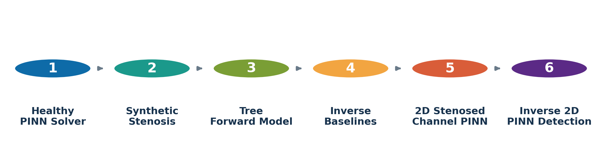
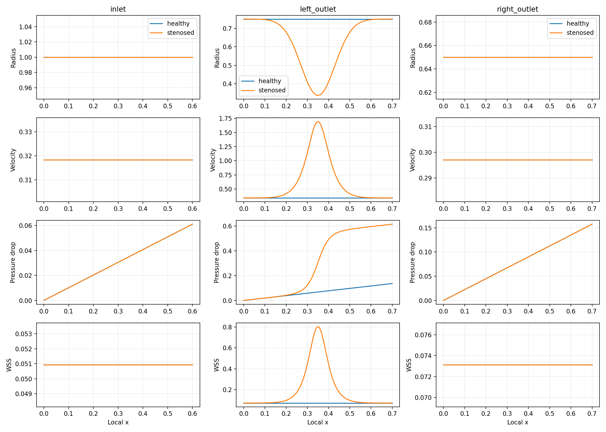
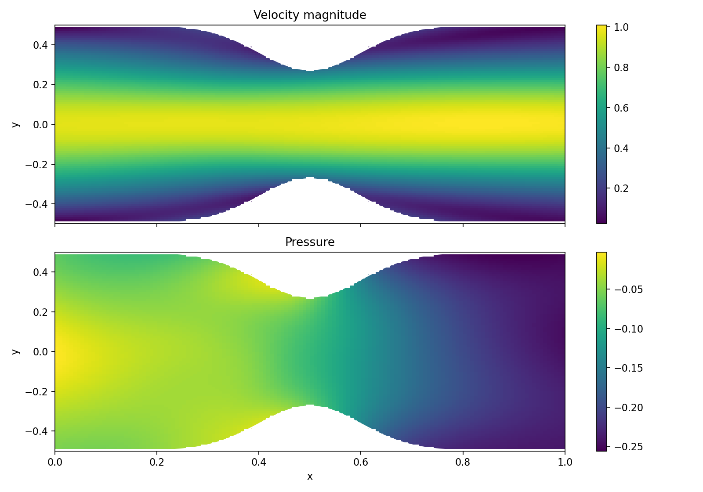
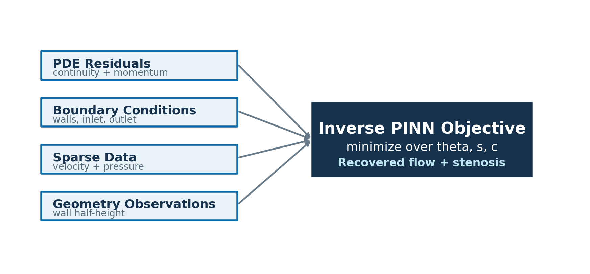
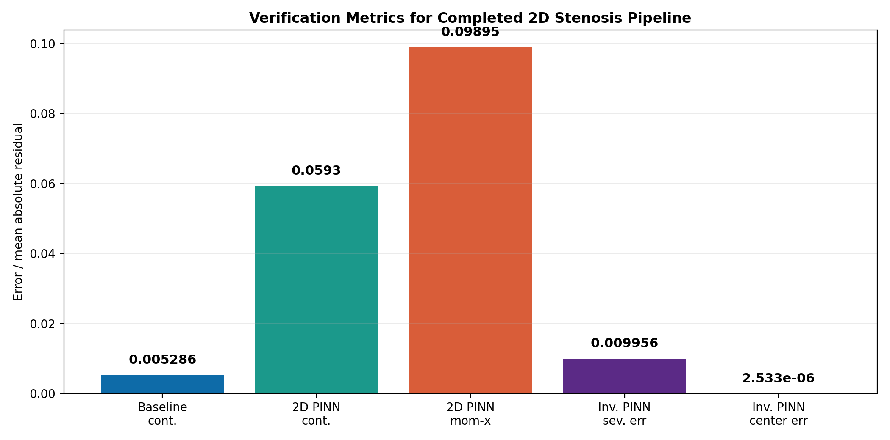

## Problem Statement

**Goal:** model cardiovascular flow and detect stenosis severity/location using a physics-informed workflow.

- Estimate velocity, pressure drop, wall shear stress, and stenosis parameters.
- Use reduced-order models for controlled synthetic data and fast validation.
- Use PINNs for the main 2D flow and stenosis-detection stages.
- Stop at a complete 2D stenosis project; no 3D component is claimed in this submission.

## Completed Project Pipeline

{width=95%}

**Final endpoint:** inverse 2D PINN recovery of stenosis severity and center.

## Physical Assumptions

We model blood as steady, incompressible, Newtonian, and laminar:

$$
\nabla\cdot \mathbf{u}=0
$$

$$
(\mathbf{u}\cdot\nabla)\mathbf{u}
+\frac{1}{\rho}\nabla p
-\nu\nabla^2\mathbf{u}=0
$$

For the 2D PINNs:

$$
\mathcal{N}_{\theta}(x,y)=
\begin{bmatrix}
u_{\theta}(x,y)\\
v_{\theta}(x,y)\\
p_{\theta}(x,y)
\end{bmatrix}
$$

## Stage 1: Healthy Baseline PINN

**Domain**

$$
\Omega_0=\{(x,y):0\le x\le L,\;-h\le y\le h\}, \qquad h=H/2
$$

**Boundary conditions**

$$
u(0,y)=U_{\max}\left(1-\frac{y^2}{h^2}\right),\qquad v(0,y)=0
$$

$$
u(x,\pm h)=v(x,\pm h)=0,\qquad v(L,y)=0,\qquad p(L,y)=P_{\text{out}}
$$

## Baseline PINN Result

{width=95%}

**Verification:** relative velocity error `0.00883`, continuity residual `0.00529`.

## Stage 2: Synthetic Single-Vessel Stenosis

The stenosed radius is modeled as a Gaussian narrowing:

$$
R(x;s,c,w)=R_0\left[
1-s\exp\left(-\frac{1}{2}\left(\frac{x-c}{w}\right)^2\right)
\right]
$$

From conservation of flow:

$$
A(x)=\pi R(x)^2,\qquad U(x)=\frac{Q}{A(x)}
$$

Pressure drop:

$$
\Delta P(x)=\int_0^x\frac{8\mu Q}{\pi R(\xi)^4}\,d\xi
$$

## Synthetic Stenosis Forward Result

{width=95%}

**Key behavior:** stenosis narrows radius, accelerates velocity, increases pressure drop, and raises wall shear stress.

## Stage 2B: Y-Bifurcation Vessel Tree

Fixed tree topology:

$$
\mathcal{B}=\{b_0,b_L,b_R\}
$$

Murray-style outlet flow split:

$$
Q_L=Q_{\text{in}}\frac{R_{0,L}^3}{R_{0,L}^3+R_{0,R}^3},
\qquad
Q_R=Q_{\text{in}}\frac{R_{0,R}^3}{R_{0,L}^3+R_{0,R}^3}
$$

Mass conservation:

$$
Q_0=Q_L+Q_R
$$

## Tree Forward Result

{width=92%}

**Verification:** inlet flow equals outlet flow sum; pressure decreases monotonically along every branch.

## Stage 3: Reduced-Order Inverse Baselines

The reduced-order inverse models are fast baselines, not the final detection endpoint.

Single-vessel inverse:

$$
(s^*,c^*)=
\arg\min_{s,c}
\mathcal{L}_{\text{RO,1D}}(s,c)
$$

Tree inverse:

$$
(s_L^*,s_R^*)=
\arg\min_{s_L,s_R}
\left[\mathcal{L}_L(s_L)+\mathcal{L}_R(s_R)\right]
$$

Classification:

$$
b^*=\arg\max_{b\in\{L,R\}}s_b^*
$$

## Reduced-Order Inverse Result

{width=95%}

**Single-vessel recovery:** severity error `0.00029`, center error `0.00051`.

**Tree recovery:** left and right outlet stenoses both classified correctly.

## Stage 4: Forward 2D Stenosed-Channel PINN

Known stenosed geometry:

$$
h(x;s,c)=h_0\left[
1-s\exp\left(-\frac{1}{2}\left(\frac{x-c}{w}\right)^2\right)
\right]
$$

$$
\Omega(s,c)=\{(x,y):0\le x\le L,\;-h(x;s,c)\le y\le h(x;s,c)\}
$$

The PINN solves Navier-Stokes in the curved stenosed domain.

## Improved 2D PINN Training Strategy

To improve the curved-domain solver:

- Larger network: `5` hidden layers, width `96`.
- More collocation points.
- Extra samples near stenosis throat.
- Extra samples near the curved walls.
- Stronger continuity and momentum residual weights.
- Weak synthetic-reference term for stable pressure/velocity learning.

Forward 2D objective:

$$
\theta^*=\arg\min_\theta
\left[
6\mathcal{L}_c+4\mathcal{L}_m+
10\mathcal{L}_{wall}+10\mathcal{L}_{in}+10\mathcal{L}_{out}
+0.5\mathcal{L}_{ref}
\right]
$$

## 2D Stenosed-Channel PINN Result

{width=95%}

**Improved residuals:**

- Continuity: `0.0593`
- Momentum-x: `0.0989`
- Momentum-y: `0.0464`
- Positive pressure drop: `0.2087`

## Main Method: Inverse 2D PINN Detection

Unknowns:

$$
\Lambda=(\theta,s,c)
$$

The neural field and stenosis parameters are learned together:

$$
(\theta^*,s^*,c^*)=
\arg\min_{\theta,s,c}
\mathcal{L}_{invPINN}(\theta,s,c)
$$

Loss:

$$
\mathcal{L}_{invPINN}
=\mathcal{L}_{PDE}
+10\mathcal{L}_{BC}
+5\mathcal{L}_{data}
+200\mathcal{L}_{geom}
$$

## Inverse PINN Loss Components

{width=90%}

This keeps stenosis detection inside the PINN framework instead of switching to a purely algebraic final step.

## Inverse 2D PINN Result

{width=95%}

**Recovery result:**

- True severity: `0.45`
- Recovered severity: `0.4400`
- Severity absolute error: `0.00996`
- True center: `0.50`
- Recovered center: `0.499997`

## Verification Summary

{width=90%}

All required stages pass verification through the completed 2D stenosis scope.

## Codebase Structure

```text
src/pinn_fluid/
  poiseuille.py                     # baseline 2D PINN
  stenosis.py                       # single-vessel synthetic forward model
  inverse_stenosis.py               # reduced-order inverse baseline
  tree_stenosis.py                  # Y-bifurcation forward model
  inverse_tree_stenosis.py          # tree inverse baseline
  stenosed_channel_pinn.py          # improved 2D stenosed-channel PINN
  inverse_stenosed_channel_pinn.py  # main inverse 2D PINN detection

scripts/
  run_*.py                          # reproducible experiment runners
```

## Reproducibility

Install:

```bash
pip install -r requirements.txt
```

Run all major checks:

```bash
python3 -m compileall src scripts
python3 scripts/run_stenosed_channel_pinn.py --severity 0.45
python3 scripts/run_inverse_stenosed_channel_pinn.py --true-severity 0.45 --true-center 0.5
```

Full commands are documented in `README.md`.

## Final Takeaways

- The project is complete through the 2D stenosis stage.
- PINNs are used for the main flow solver and final stenosis detection step.
- Reduced-order models provide synthetic data, interpretable baselines, and tree-level checks.
- The improved 2D PINN is stable enough for submission-level results.
- The repository is organized, documented, and ready for review.

